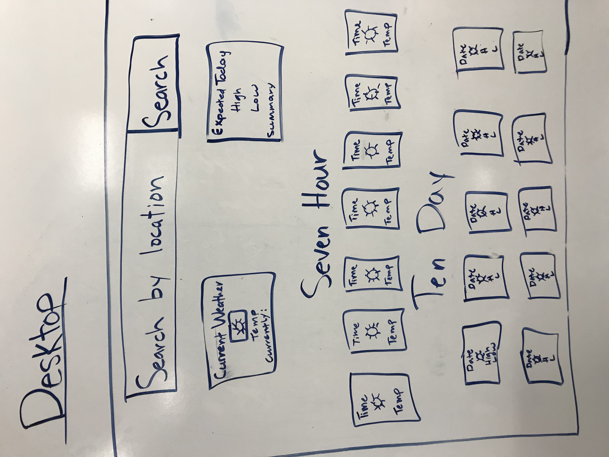
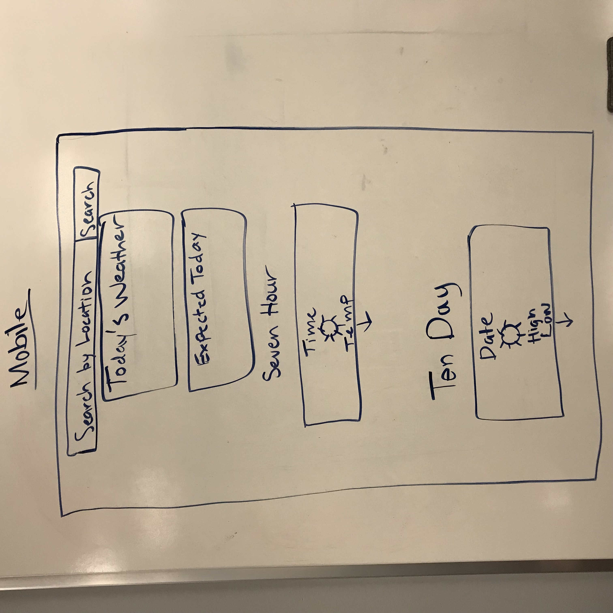

# Weathrly
## Group members: 
  Emily Kuckelman and Chase Richard 
  
## Wireframes:
### Desktop

### Mobile

## Project Specs
  This was our first project using React! It was challenging at first getting used to the new sytax and component interactions. This was also our first time testing with Enzyme and Jest. The project, like all projects at Turing, was built completely from scratch based on the following specs:
  
 Your app should have the following components.
  *App
  *Welcome
  *Search
  *Current Weather
  *7 Hour Forecast
  *10 Day Forecast
  *Card (used in 7 hour and 10 day)
  
